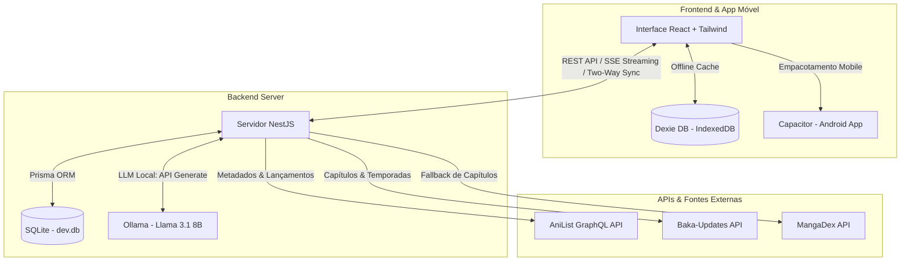
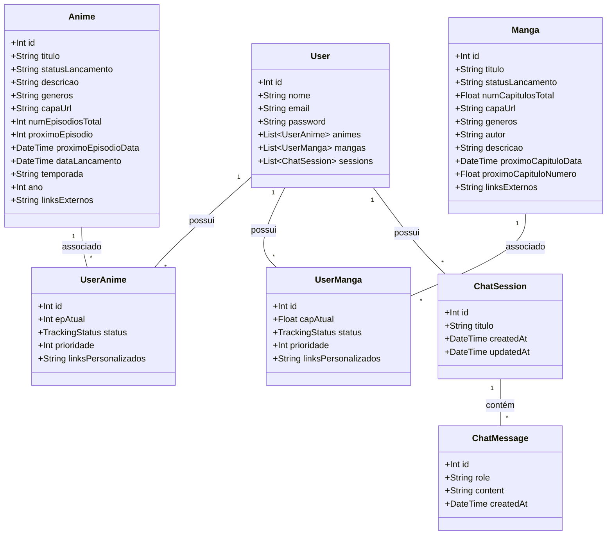

# 🤖 Otaku Time Pro (v2.0)

O teu gestor inteligente de Anime & Manga, alimentado por Inteligência Artificial (LLM Local) e com arquitetura robusta Offline-First para desktop e telemóvel.

O **Otaku Time Pro** é um ecossistema Fullstack concebido para entusiastas que procuram organizar as suas bibliotecas de anime e manga, visualizar calendários de lançamentos com fuso horário local e interagir com um assistente virtual especialista que conhece os seus gostos em tempo real.

---

## 🚀 Principais Diferenciais e Funcionalidades

### 📱 1. Ecossistema Mobile & Offline-First (Android via Capacitor)
* **Offline-First (Dexie DB):** O telemóvel guarda o teu progresso de animes, mangas e chats localmente via **IndexedDB (Dexie DB)**, permitindo navegação, pesquisa e gestão de biblioteca mesmo sem qualquer ligação à internet.
* **Layout Responsivo Adaptativo:** Através de `Capacitor.isNativePlatform()`, o frontend deteta se está num dispositivo móvel e ajusta a UI dinamicamente (ocultando filtros redundantes, adaptando o calendário para ecrãs menores e otimizando a barra de pesquisa), mantendo a versão desktop intocada.

### 🔄 2. Sincronização Bidirecional Inteligente (Two-Way Sync)
* **Fusão Sem Perdas:** O endpoint `/sync/twoway` no servidor NestJS recebe os dados do telemóvel e executa uma lógica inteligente de `upsert` na base de dados SQLite através do Prisma, comparando o progresso mais recente (ex: maior número de episódios/capítulos lidos) e fundindo as duas bases de dados numa versão unificada que atualiza o dispositivo móvel.
* **Múltiplos Modos de Ligação:** Centro de controlo configurável na página de perfil (`/profile`) com estatísticas de armazenamento local em tempo real e suporte para ligação via **Wi-Fi (Rede Local)**, **Cabo USB (ADB Reverse)** ou **Cloud Server**.

### 🧠 3. Assistente de IA Local (Otaku Bot)
* **Integração Direta com Ollama:** O assistente de recomendações foi integrado diretamente no backend NestJS (removendo a necessidade de um microserviço Python externo) e consome localmente o modelo **Llama 3.1 8B**.
* **Recomendações Contextuais:** O bot conhece o fuso horário e a lista pessoal do utilizador, sugerindo novas obras que não estejam na sua biblioteca. Usa a API do AniList por baixo para validação semântica e devolve referências formatadas em `[REC:ID]`.
* **Streaming SSE:** Respostas em tempo real com efeito de digitação fluida.
* **Auto-Nomeação de Sessões:** O LLM analisa a primeira mensagem da conversa e renomeia automaticamente a sessão com um título criativo em português de 3 palavras.

### 📚 4. Rastreio Inteligente de Mangas (Smart Chapter Sync)
Resolve as limitações e inconsistências das APIs tradicionais com um sistema de rastreio de capítulos em três planos:
* **Plan A (Baka-Updates):** Consulta o MangaUpdates para obter a contagem exata e detalhada de capítulos e divisórias de temporadas/especiais (essencial para Webtoons/Manhwas).
* **Plan B (MangaDex):** Fallback robusto que realiza a pesquisa por ID AniList ou por título aproximado para obter a contagem mais recente do feed.
* **Plan C (AniList):** Utilização da contagem de capítulos nativa da AniList para obras já finalizadas.

### 📅 5. Calendário Pessoal Dinâmico
* **Filtro Focado:** Exibe os lançamentos agendados para os próximos 7 dias.
* **Inteligência de Lançamento:** Mapeia apenas as obras que constam na tua lista sob o estado `RELEASING`.
* **Fusos Horários Corretos:** Extrai o timestamp de lançamento da API AniList e converte-o automaticamente do horário do Japão (JST) para o teu fuso horário local.

### 📊 6. Dashboard de Acompanhamento Premium (To-Watch/Read)
* **Vista Dual-Column:** Separadores dedicados para "VER ASSEGUIR" (Animes) e "LER ASSEGUIR" (Mangas).
* **Optimistic UI:** Atualiza o progresso visualmente no frontend de forma imediata ao clicar nos botões rápidos "Visto" ou "Lido", processando a sincronização com o servidor em segundo plano.
* **Progressão Inteligente:**
  * **Auto-Start:** Mudar o progresso de `0` para `1` altera o estado automaticamente para `WATCHING`.
  * **Auto-Complete:** Ao atingir o último capítulo/episódio disponível, o estado é atualizado automaticamente para `COMPLETED`.

---

## 🛠️ Arquitetura do Sistema



### Tecnologias Utilizadas

| Camada | Tecnologia | Descrição |
| :--- | :--- | :--- |
| **Backend** | NestJS (v11) | Framework progressivo em Node.js com TypeScript |
| **BD & ORM** | Prisma + SQLite | Banco de dados leve e portátil com migrações simples |
| **Frontend** | React + Vite + TailwindCSS | Interface veloz, responsiva e com estilização moderna |
| **Offline-First** | Dexie DB | Wrapper do IndexedDB para armazenamento no telemóvel |
| **Mobile** | Capacitor | Empacotamento híbrido de alto desempenho para Android |
| **IA Engine** | Ollama / Llama 3.1 | Motor local para geração de texto e processamento de linguagem natural |
| **Data Sources** | AniList / MangaUpdates / MangaDex | APIs integradas de catálogo, agenda e capítulos de manga |

---

## 📐 Diagrama de Classes (Base de Dados)



---

## 📂 Guia de Pastas

```bash
Otaku-Time-v2/
├── prisma/                  # Configuração do SQLite e Schema de tabelas do Prisma
│   └── schema.prisma        # Modelo relacional principal
├── src/                     # Backend NestJS
│   ├── anime/               # Módulo de importação e sincronização com AniList
│   ├── manga/               # Módulo de integração (Baka-Updates, MangaDex, AniList)
│   ├── chat/                # Serviço de IA local (Ollama + Llama 3.1)
│   ├── sync/                # Endpoint de Sincronização Bidirecional (/sync/twoway)
│   └── user/ & auth/        # Gestão de utilizadores e autenticação JWT
├── otaku-ui/                # Frontend React + Vite + Capacitor
│   ├── android/             # Projeto nativo gerado pelo Capacitor para Android Studio
│   ├── src/                 
│   │   ├── pages/           # Dashboard (Home), Biblioteca, Chat, Calendário e Perfil
│   │   ├── services/        
│   │   │   ├── apiBridge.ts # Comunicação dinâmica entre servidor/telemóvel e offline
│   │   │   └── localDb.ts   # Esquema do banco de dados local móvel (Dexie DB)
│   │   └── context/         # Estados globais de navegação e biblioteca
│   └── capacitor.config.ts  # Configuração de portas e builds do Capacitor
```

---

## 🛠️ Passo a Passo de Configuração

### Requisitos Prévios
* **Node.js** (v18 ou superior)
* **Ollama** configurado com o modelo `llama3.1` (a correr em `http://localhost:11434`)
* **Android Studio** (apenas para builds e deploys móveis com Capacitor)

### 1. Configurar o Servidor (Backend)
Na pasta raiz do projeto:

1. Instalar as dependências:
   ```bash
   npm install
   ```
2. Garantir que o ficheiro `.env` está na raiz com o caminho correto do SQLite:
   ```env
   DATABASE_URL="file:./prisma/dev.db"
   ```
3. Inicializar e aplicar o esquema na base de dados:
   ```bash
   npx prisma db push
   ```
4. Arrancar o servidor backend (corre em `http://localhost:3001`):
   ```bash
   npm run start:dev
   ```

### 2. Configurar o Cliente (Frontend React)
Navegar para a pasta `otaku-ui`:

1. Instalar as dependências:
   ```bash
   cd otaku-ui
   npm install
   ```
2. Iniciar o servidor de desenvolvimento Vite (corre em `http://localhost:5173`):
   ```bash
   npm run dev
   ```

### 3. Configurar a Aplicação Móvel (Android/Capacitor)
Para compilar e correr a app móvel diretamente no telemóvel/emulador:

1. Construir os estáticos do React:
   ```bash
   npm run build
   ```
2. Sincronizar os ficheiros compilados com a pasta nativa de Android:
   ```bash
   npx cap sync
   ```
3. Abrir o projeto no Android Studio para emular ou criar o ficheiro APK:
   ```bash
   npx cap open android
   ```
   *Nota: Se estiver a depurar via cabo USB no telemóvel físico, utilize o comando `adb reverse tcp:3001 tcp:3001` para que a aplicação móvel consiga aceder ao servidor backend a correr na sua máquina local.*

---

## 💡 Comandos Úteis

* **Ver a Base de Dados (Interface Visual):**
  ```bash
  npx prisma studio
  ```
* **Forçar Re-sincronização do SQLite:**
  ```bash
  npx prisma db push
  ```
* **Arrancar o Ollama com o modelo correto:**
  ```bash
  ollama run llama3.1
  ```