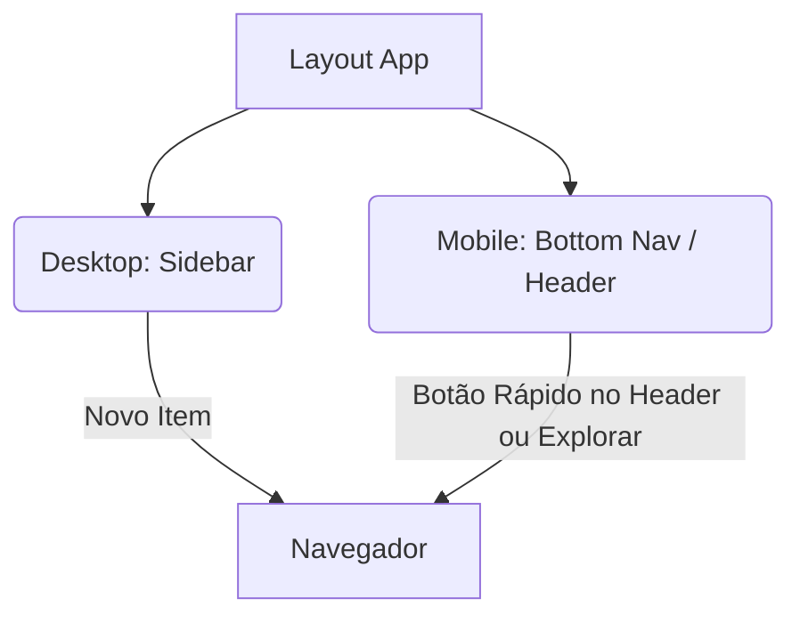

# Proposta: Navegador Integrado (In-App Browser) no Otaku-Time

Esta proposta detalha a arquitetura, interface e funcionalidades para implementar um **Navegador Web Integrado** dentro do Otaku-Time v2, permitindo aos utilizadores ler mangas e ver animes diretamente na app, mantendo o controlo de progresso e bloqueio de anúncios.

---

## 🎨 Onde colocar o Botão na Interface?

Para garantir fácil acesso sem sobrecarregar a interface atual:

### 1. No Menu de Navegação (Desktop & Mobile)
* **Desktop (Sidebar):** Adicionar um novo botão no menu lateral entre "Calendário" e "Perfil".
  * **Ícone:** `public` (globo terrestre) ou `travel_explore`.
  * **Texto:** "Navegador" ou "Web Reader".
* **Mobile (Bottom Nav):** Atualmente a barra inferior tem 5 botões (Home, Explorar, My List, Agenda, Me). 
  * *Opção A:* Adicionar como 6º botão (pode ficar apertado em ecrãs pequenos).
  * *Opção B (Recomendada):* Colocar um atalho flutuante premium ou um botão destacado no cabeçalho do **Explorar** ou da **Biblioteca**. Por exemplo, um botão estilizado "Navegar na Web" no topo da página Explorar.



---

## 🖥️ Painel Inicial do Navegador (`BrowserPage`)

Quando o utilizador clica em "Navegador", abre-se um dashboard moderno com as seguintes secções:

### 1. Barra de Pesquisa Inteligente
* **Comportamento:** 
  * Se o utilizador digitar um termo (ex: `solo leveling manga`), a app pesquisa no DuckDuckGo ou Google.
  * Se digitar um URL válido (ex: `mangadex.org` ou `https://...`), navega diretamente para o site.
* **Sugestões Automáticas:** À medida que digita, mostra histórico recente de pesquisa.

### 2. Grelha de Sites Afixados (Quick Links / Bookmarks)
Um grid de cartões altamente estilizados (Glassmorphism, gradientes e animações de hover) com os sites favoritos do utilizador:
* **Predefinidos (Exemplos):** MangaDex, MangaReader, Crunchyroll, etc.
* **Personalização:** Um botão `+` (Adicionar Site) que abre um modal para introduzir Nome, URL e Icon.
* **Base de dados:** Guardado localmente no dispositivo usando a biblioteca **Dexie** (IndexedDB) já existente no projeto.

---

## 🚀 Funcionalidades Avançadas ("Mais algumas cenas")

Aqui estão as funcionalidades premium que tornariam este navegador único e indispensável para a comunidade Otaku:

| Funcionalidade | Descrição | Implementação Técnica |
| :--- | :--- | :--- |
| **🔍 Detetor de Leitura (Auto-Sync)** | **A funcionalidade mais importante!** Quando o utilizador está a ler um capítulo (ex: URL contém `/manga/solo-leveling/chapter-15`), o navegador deteta o padrão e mostra um pequeno banner: *"Lendo Solo Leveling - Cap. 15. Sincronizar com a biblioteca?"* | Extrair título/capítulo da URL do WebView através de Regex no `WebViewClient` e comunicar com o React via Capacitor Bridge. |
| **🛡️ Gestor de Anúncios (AdBlocker)** | Ativar/desativar o AdBlocker nativo e ver estatísticas de anúncios bloqueados. | Expandir o `MangaWebViewPlugin.java` para contar e reportar o número de requisições bloqueadas para a UI. |
| **📚 Marcadores & Histórico** | Lista de páginas visitadas recentemente e possibilidade de guardar páginas específicas como "Marcadores". | Tabela adicional no Dexie (IndexedDB) para guardar `historico` e `favoritos_web`. |
| **🌙 Modo Leitura Escuro (Force Dark)** | Forçar páginas Web de leitura a usar fundo escuro para leitura noturna confortável. | Injetar CSS personalizado (Dark Reader style) via JavaScript na página carregada. |

---

## 🛠️ Arquitetura Técnica Recomendada

Como a app usa **Capacitor** no Android e **React** no Frontend:

### Fluxo de Funcionamento no Android (Nativo)
1. O utilizador acede à página de dashboard do Navegador (feita em React).
2. Ao clicar num site afixado ou pesquisar, a app chama o plugin nativo `MangaWebView` (que já criaste e que tem AdBlocker nativo).
3. O `MangaWebView` abre em modo ecrã completo com a barra de navegação inferior (Voltar, Avançar, Recarregar, Abrir no Chrome).

### Fluxo no Web/Desktop (Fallback)
1. Como o `MangaWebView` nativo só funciona em Android, no Desktop usamos um Modal com um `<iframe>` (com aviso de que alguns sites podem bloquear devido a políticas CSP) ou redirecionamos para abrir numa nova aba (`window.open(url, '_blank')`).

> [!NOTE]
> O plugin `MangaWebViewPlugin.java` atual já tem uma excelente fundação com bloqueador de publicidade e manipulação do botão físico do Android. Podemos simplesmente estendê-lo para expor métodos adicionais ou apenas usá-lo para abrir qualquer URL digitada pelo utilizador.

---

## 🔮 Protótipo Visual Sugerido para a UI (React)

```
+-------------------------------------------------------+
|  Navegador Web                                  [ 🛡️ ] |
+-------------------------------------------------------+
|  [ https://mangadex.org                     ] [ Ir ]  |
+-------------------------------------------------------+
|                                                       |
|  Sites Afixados                                       |
|  +--------------+  +--------------+  +--------------+ |
|  |  MangaDex    |  |  MangaReader |  |  Crunchyroll | |
|  |   [Icon]     |  |   [Icon]     |  |   [Icon]     | |
|  +--------------+  +--------------+  +--------------+ |
|  |  Adicionar + |                                     |
|  +--------------+                                     |
|                                                       |
|  Histórico Recente                                    |
|  - Solo Leveling - Capítulo 144 (há 2 horas)          |
|  - One Piece - Capítulo 1110 (ontem)                  |
|                                                       |
+-------------------------------------------------------+
```

---

> [!TIP]
> **Próximo Passo:** Se quiseres avançar com esta funcionalidade, podemos criar uma nova rota `/browser` no React Router, criar a página `BrowserPage.tsx` com o design de Pinned Sites e campo de pesquisa, e integrá-la com o teu plugin `MangaWebView` nativo.
