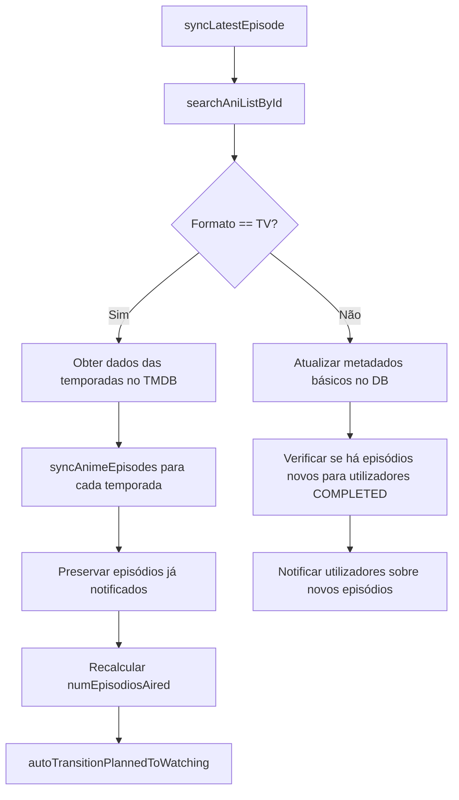
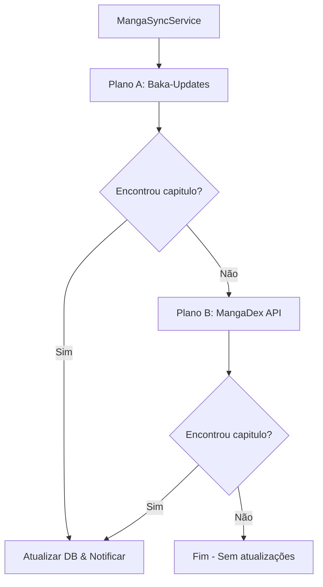

# 🔄 Mecanismos de Sincronização: Otaku Time

Esta página descreve em detalhe o funcionamento técnico e a lógica dos mecanismos de sincronização automática e manual implementados no ecossistema do **Otaku Time**.

---

## 📅 1. Coordenação e Agendamento (Cron Jobs)

A coordenação principal de todas as tarefas de sincronização em segundo plano é realizada no [SyncService](file:///c:/Users/Utilizador/source/repos/Otaku-Time-v2/src/sync/sync.service.ts), utilizando dois agendamentos `@Cron` baseados no pacote `@nestjs/schedule`:

1. **Sincronização Periódica de Dados (`@Cron('0 */30 * * * *')`):** 
   Executada de 30 em 30 minutos. Invoca o método `checkAndRunScheduledSyncs()`, que avalia quais as séries (Anime/Manga) que necessitam de sincronização.
2. **Notificações Locais (`@Cron(CronExpression.EVERY_HOUR)`):** 
   Executada a cada hora. Invoca o método `handleLocalNotificationsCron()`, que verifica episódios estreados recentemente e dispara notificações em lote na aplicação.

### 🛡️ Políticas de Otimização e Segurança de Recursos
* **Deteção de Inatividade:** Ambas as tarefas consultam o `KeepAwakeService` ([keep-awake.service.ts](file:///c:/Users/Utilizador/source/repos/Otaku-Time-v2/src/keep-awake.service.ts)). Se não for registada atividade de utilizadores nas últimas **2 horas**, a sincronização automática é saltada para poupar recursos de processamento e acessos à base de dados.
* **Janela Noturna de Poupança:** A sincronização agendada é suspensa se a hora local estiver entre as **2:00 AM e as 7:00 AM** (Europe/Lisbon).
* **Gestão de Sincronizações Presas:** No início de cada verificação, o sistema deteta e marca como `FAILED` todos os registos de sincronização (`SyncLog`) no estado `RUNNING` que estejam em execução há mais de 2 horas.
* **Salvaguarda contra Abuso (Guard de 20h) e Resolução de Fila:** Antes de iniciar uma atualização de longa duração (`ANIME_FULL` ou `MANGA_FULL`), verifica-se se há registos cuja data de última atualização (`updatedAt`) é superior a 7 dias. Se houver, o sistema tenta executar o sync. Para evitar sobrecargas e timeouts, cada execução atualiza um lote de até **100 itens mais desatualizados**. A salvaguarda de 20 horas garante que, se existirem mais de 100 itens pendentes (ex: 400 itens), o sistema executará um lote a cada 20 horas, completando todo o backlog em poucos dias (ex: 4 dias para 400 itens), em vez de esperar semanas.

---

## 🗂️ 2. Tipos de Janelas de Sincronização

Durante o ciclo de verificação, o sistema divide as tarefas necessárias em quatro janelas distintas:

### A. Sincronização de Anime
* **`ANIME_ACTIVE` (Diária):** Sincroniza apenas as séries em estado ativo/em lançamento (`statusLancamento !== 'FINISHED'` ou similar).
* **`ANIME_FULL` (Semanal / Fila Throttled):** Atualiza os **100 animes mais desatualizados** (com o `updatedAt` mais antigo há mais de 7 dias) para atualizar metadados de temporadas e episódios. Caso existam mais de 100 pendentes, novos lotes são processados a cada 20 horas.

### B. Sincronização de Manga
* **`MANGA_MIDDAY` / `MANGA_NIGHT` (Duas vezes por dia):** Sincroniza os mangas em lançamento (`RELEASING`) com base na janela horária atual (Midday a partir das 12:00h e Night a partir das 22:00h).
* **`MANGA_FULL` (Semanal / Fila Throttled):** Atualiza os **100 mangas mais desatualizados** da base de dados, processando novos lotes a cada 20 horas se o backlog for superior a 100 itens.

---

## 📺 3. Mecanismo de Sincronização de Anime

A lógica de atualização individual de episódios está localizada no [AnimeService](file:///c:/Users/Utilizador/source/repos/Otaku-Time-v2/src/anime/anime.service.ts):

### Detalhes do Fluxo
1. **Importação e Atualização de Informação Básica:** O método `syncLatestEpisode(tmdbId)` consulta as APIs do AniList e TMDB para obter capas, status de lançamento e dados do próximo episódio.
2. **Mapeamento de Episódios (`syncAnimeEpisodes`):** Procura recursivamente no TMDB a lista de episódios de todas as temporadas disponíveis. O sistema monta a lista mantendo a flag `notified: true` para os episódios que o utilizador já sabe que estrearam.
3. **Transições Automáticas de Estado de Acompanhamento:**
   * **De *Concluído* para *A ver*:** Se forem detetados novos episódios no catálogo e o utilizador tinha marcado a obra como `COMPLETED`, o sistema reverte a relação para `WATCHING` e gera uma notificação.
   * **De *Planeado* para *A ver* (`autoTransitionPlannedToWatching`):** Implementado no [CalendarService](file:///c:/Users/Utilizador/source/repos/Otaku-Time-v2/src/anime/calendar.service.ts). Se o primeiro episódio de um anime na lista de desejos (`PLANNED`) estrear, o status do utilizador é movido automaticamente para `WATCHING` ("A ver"), acompanhado de uma notificação interna.

---

## 📖 4. Mecanismo de Sincronização de Manga

Devido à falta de uma API centralizada que forneça o progresso de capítulos de mangas de forma gratuita, o [MangaSyncService](file:///c:/Users/Utilizador/source/repos/Otaku-Time-v2/src/manga/manga-sync.service.ts) implementa um mecanismo resiliente de **duas fontes de dados**:

### Detalhes das Fontes
* **Plano A: Baka-Updates (MangaUpdates)**
  Efetua uma pesquisa por título na API do Baka-Updates. Analisa sintaticamente o texto bruto presente no campo `status` (ex: *"15 Chapters (Complete)"* ou divisões por volumes) para extrair e somar os blocos de capítulos.
* **Plano B: MangaDex (Contingência)**
  Caso o Plano A falhe ou não devolva capítulos válidos, o sistema consulta a API do MangaDex. Associa a obra mapeando o ID do AniList ou recorrendo a correspondências fonéticas de título. De seguida, extrai a contagem mais alta do campo `lastChapter` nos metadados ou lê as últimas entradas do feed de lançamentos da obra (`/feed`).
* **Regras de Negócio e Atualização:**
  Se for encontrado um capítulo superior ao registado localmente:
  * O sistema atualiza o total de capítulos do Manga e define o número esperado para o próximo lançamento.
  * Transita utilizadores com estado `COMPLETED` de volta para `WATCHING` se o progresso lido estiver abaixo do novo máximo.
  * Dispara notificações em tempo real para os leitores ativos: *"O capítulo X de Y foi lançado!"*.

---

## 📧 5. Notificação de Administradores

No final de cada sincronização completa (`ANIME_FULL` ou `MANGA_FULL`), o `SyncService` gera um relatório detalhado.
O sistema pesquisa na tabela `User` por utilizadores com permissão de administrador (`tipoConta: 'ADMIN'`) e envia-lhes um e-mail formatado com o assunto `[Otaku Time] Sincronização Completa de Animes/Mangas - Sucesso/Falha` detalhando:
* A data/hora local da sincronização.
* O estado final da operação (Sucesso / Falha).
* A quantidade de registos atualizados nesta etapa.
* Os detalhes ou stack trace de erros ocorridos em background (se falhar).
* **Uma lista contendo todos os títulos (Animes/Mangas) que foram atualizados com sucesso** neste lote.

---

## ⚙️ 6. Execução Manual

Os administradores têm à disposição um endpoint de controlo no [SyncController](file:///c:/Users/Utilizador/source/repos/Otaku-Time-v2/src/sync/sync.controller.ts):
* **`POST /sync/start`:** Inicia imediatamente o método `runManualSync()` em background. Esta ação ignora os agendamentos automáticos e executa a sincronização ativa imediata de animes e mangas, registando o processo sob a etiqueta `[MANGA_MANUAL]`.
